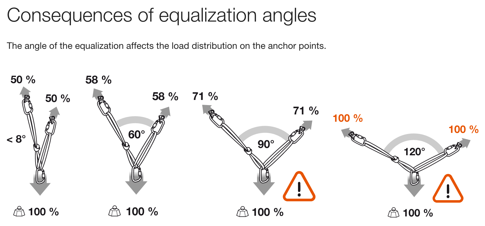
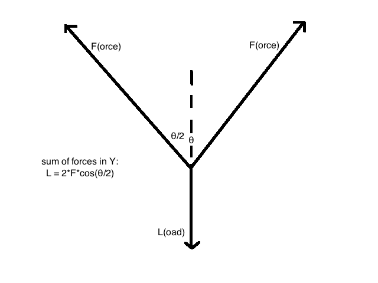
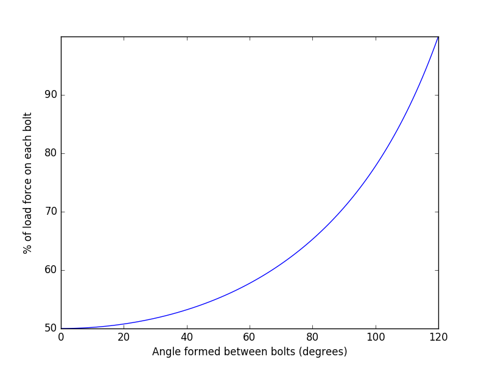

Two Bolt Anchor
===
I was confused by the forces shown by Petzl in their equalization angles diagrams shown here:

Two test or verify this I wrote some code in a few languages to plot the resultant forces vs the angle. Here is the partial free-body diagram I came up with the code is based on:

I wanted a simple, portable way to plot right inside my C++ code that would require little work on my system. I found a nice little Python wrapper called [matplotlib-cpp](https://github.com/lava/matplotlib-cpp). The C++ example could be better, but the point is proven.

The results confirmed the graphic:

